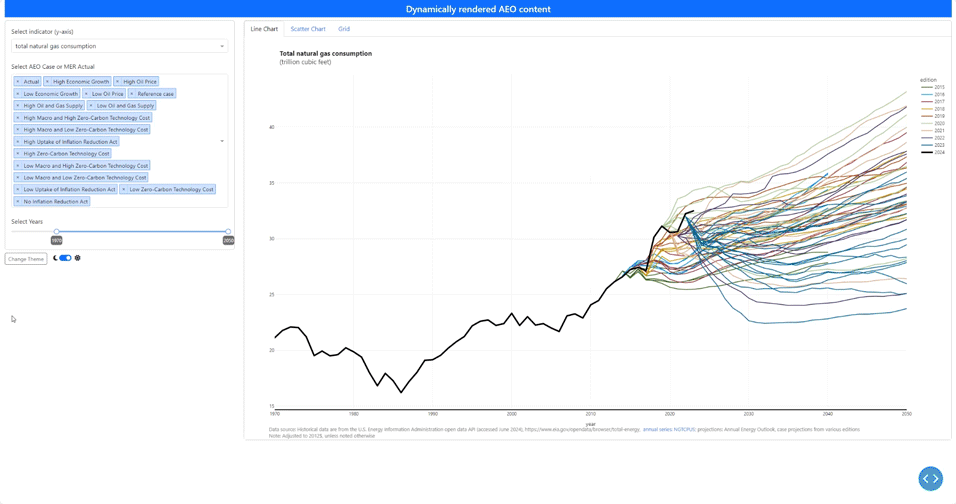

[](https://www.eia.gov)

# *dash-benchmark*, a Dash/Plotly application


This public app is a fully interactive viz companion to the *Annual Energy Outlook* (AEO) released by the U.S. Energy Information Administration's (EIA) National Energy Modeling System (NEMS). It is not intended to be a live product hosted by EIA but rather an application to increase the transparency of our products to our customers, as well as display the linkages among EIA's many statistical, analytical, and informational products.

## Introduction
We project U.S. energy production, consumption, and prices each year in the [*Annual Energy Outlook*](https://www.eia.gov/outlooks/aeo/) (AEO). We produce the AEO on an alternating cycle: in even years, we include complete documentation and several alternative cases, and in odd years, we include limited documentation and fewer alternative cases. Following an even year AEO, we also produce an [*Annual Energy Outlook Retrospective Review*](https://www.eia.gov/outlooks/aeo/retrospective/) (AEO Retrospective) which compares recent history with **Reference** case projections from previous editions of the AEO. The AEO Retrospective shows the relationship between past AEO projections and actual energy indicators from EIA's [*Monthly Energy Review*](https://www.eia.gov/totalenergy/data/monthly/), and it informs discussions about the underlying models.

This application extends and expands on EIA's Retrospective Reviews. While the *AEO Retrospective Reviews* focus on **Reference** case projections, this new analytic tool supports a wider range of the AEO products and contains a range of cases, and this range explores some of the uncertainty inherent in long-term projections, as part of an effort to enhance transparency of AEO projections, as well as reveal realized values (that is, actual history) for projected data series. Note that we are doing so for a select number of key market indicators, rather than for the more than 16,000 data series produced from a single AEO release.

Each year’s AEO typically includes **Low and High Economic Growth** cases, **Low and High Oil and Gas Supply** cases, **Low and High Oil Price** cases, and **Low and High Renewables Cost** cases, which could be construed as core side cases for AEO. Past AEOs have also included alternative cases examining the impact of proposed policy changes. For this visualization, the **Actual** case represents observed annual history from the *Monthly Energy Review*.

## Description
The dash-benchmark repository explores the results from AEO2015 through AEO2023, using those data series from EIA's retrospective review products that also are available from our Open Data portal. We are committed to free and open data by making it available through our [website](https://www.eia.gov) as well as an [Application Programming Interface (API) and its open data tools](https://www.eia.gov/opendata/). EIA's API is multi-faceted and contains all of this application's time-series data sets organized by the main energy categories.

## Getting started
These instructions will get a copy of the project up and running on your local machine for development and testing purposes.

### Installing and running (quick start)
1. Copy the repository https://github.com/EIAgov/dash-benchmark.git
2. Create a new virtual environment with your preferred tools
3. Install the dependencies (make certain your preferred virtual environment is activated) or complete as part of step 2
4. Download the [data in csv format](https://www.eia.gov/outlooks/aeo/retrospective/datafile/eia-aeo-mer-benchmark-sep2024.csv) and place csv file into the ```dash-benchmark\src\data``` folder
4. Navigate to the ```dash-benchmark\src``` directory with the app.py
5. Run the dashboard with the terminal command:

```powershell
(dash-benchmark-env) $ python app.py
```

To close, first exit out of the browser and then hit <kbd>ctrl-c</kbd> twice in the terminal window.

### Python Requirements <a name="requirements"></a>

*dash-benchmark* runs on **Python version 3.12**. [Install anaconda 3](https://docs.anaconda.com/anaconda/install/) if there is not already a Python distribution installed. You also will need to create a Python virtual environment that runs Python 3.12. We have not tested earlier or later versions of Python but do provide a minimal environment.yml and requirements.txt in the dash-benchmark repository.

  

Also, *dash-benchmark* most importantly requires **Dash version >=2.17.1**. As of version 2.0, Dash no longer supports Python 2. 

The `enviroment-dash-3.12.yml` and `requirements.txt` in the `dash-benchmark` root folder provide lists of Python packages and their versions needed to run *dash-benchmark*. 

Here are some of those key packages:
  
  
   
  
  
   
  
  
  
  
  
    
  
  


### Create an empty virtual environment

You can use either [conda][conda-env] or [virtualenv][virtualenv] to create an empty virtual environment for development, e.g.:

```powershell
$ conda create -n dash-benchmark-env python=3.12
$ conda activate dash-benchmark-env
```
[conda-env]: https://docs.conda.io/projects/conda/en/latest/user-guide/tasks/manage-environments.html#creating-an-environment-with-commands
[virtualenv]: http://docs.python-guide.org/en/latest/dev/virtualenvs/

As an alternative, we provide a yml for creating the virtual environment (see below). As of September 2024 our dependencies have been tested against Python version 3.12. Here are some details on environments.
### Install requirements - (Windows + Conda)
We suggest your environment reflect these packages. Below is some guidance on creating a conda enviroment from an environment.yml file

1. Create a predefined conda environment from a suitable environment.yml file, in our case environment-dash-3.12.yml
```powershell
$ conda env create -f environment-dash-3.12.yml
```
2. Verify the creation of the "dash-benchmark-env" environment
```powershell
$ conda info --envs
```
If this command is run by an administrator, a list of all environments belonging to all users will be displayed.  

3. Activate the "dash-benchmark-env" conda environment
```powershell
$ conda activate dash-benchmark-env
```
### Install requirements - (venv)
Note that the dash-benchmark-env virtual environment is displayed as active.
```powershell
(dash-benchmark-env) $ pip install -r requirements.txt
```

Dash offers a more extensive description of requirements at their [contribution][dash_contributing] page.

[dash_contributing]: https://github.com/plotly/dash/blob/dev/CONTRIBUTING.md

### Run *dash-benchmark* locally

First, clone the repository found at [https://github.com/EIAgov/dash-benchmark.git](https://github.com/EIAgov/dash-benchmark.git)

**After activating the dash-benchmark or another suitable environment** in terminal (MacOS) or command prompt (Windows), navigate inside the `dash-benchmark\src` folder and run the application by typing and executing the following:

```powershell
(dash-benchmark-env) $ python app.py
```

A URL with an IP address including `127.0.0.1` should appear that can be copied and pasted in a browser. `127.0.0.1` is the localhost of your local machine, and the `8050` is the port that is specified in the application:

```
Dash is running on http://127.0.0.1:8050/

 * Serving Flask app 'app'
 * Debug mode: on
```

Second, after launching the application, you should see and be able to interact with *dash-benchmark* in the browser. This is only visible to you on your local machine for as long as you are running the script.

 

Note that execution may start in your default web browser; however, these starting options may be overridden when executing the 'app.py' on your terminal. That's all for use.

Lastly, you may also run the app.py file from VS Code and open the IP address. Testing has not been completed with any other IDE other than VS Code. 

## Screenshots of visualizations at EIA
|**Examples**|**Descriptions**|
|:---:|:---|
| {width=85%} | Shows the relationship between past AEO projections and actual energy indicators. <br>Fully interactive components (including double-clicking legends) allow selection of data series, cases and range of years, as well as downloading of data and figures. |
---

## Data dictionary
We produce a large volume of statistics and analyses at EIA, most of which are *free to download and use*. To help navigate the data used herein, we provide a small data dictionary of facets on the **Annual Energy Outlook** and **Total Energy** endpoints using EIA's [Open Data](https://www.eia.gov/opendata/browser/) to get users started.


|**Series for<br>Annual Energy<br>Outlook**<sup>1</sup> |**Series for<br>Total Energy**|**Labels**|**Retrospective<br>Review<br>Table<br>Numbers**<sup>2</sup>|
|:---|:---|:---|:---:|
|eci_NA_NA_NA_gdp_real_NA_blny09dlr|GDPRVUS|Real gross domestic product|3|
|prce_NA_NA_NA_cr_imco_usa_ndlrpbrl|RAIMUUS|Imported refiner acquisition cost of crude oil (nominal $)|4b|
|cnsm_NA_lfl_NA_tot_NA_usa_millbrlpdy|PATCPUS|Total petroleum and other liquids consumption|5|
|sup_prd_NA_NA_cr_NA_usa_millbrlpdy|PAPRPUS|Domestic crude oil production|6|
|trad_NA_lfl_tot_netimp_NA_usa_millbrlpdy|PANIPUS|Petroleum net imports|7|
|prce_delv_elep_NA_ng_NA_usa_ndlrpmcf|NGEIUUS|Natural gas price, electric power sector (nominal $)|8b|
|cnsm_NA_alls_NA_ng_tot_usa_trlcf|NGTCPUS|Total natural gas consumption|9|
|sup_dpr_NA_NA_ng_tot_usa_trlcf|NGPRPUS|Dry natural gas production|10|
|trad_netimp_NA_NA_ng_NA_usa_trlcf|NGNIPUS|Natural gas net imports|11|
|prce_nom_elep_NA_stc_NA_NA_ndlrpmbtu|CLERDUS|Coal prices to electric generating plants (nominal $)|12b|
|cnsm_NA_NA_NA_cl_NA_NA_millton|CLTCPUS|Total coal consumption|13|
|sup_NA_NA_NA_cl_NA_NA_millton|CLPRPUS|Coal production excluding waste coal|14|
|prce_NA_elep_NA_edu_NA_usa_ncntpkwh|ESTCUUS|Average electricity prices (nominal $)|15b|
|cnsm_NA_elep_NA_els_NA_usa_blnkwh|ESTCPUS|Total electricity sales excluding direct use|16|
|gen_NA_alls_NA_slr_NA_NA_blnkwh|SOETPUS|Solar net generation (all sectors)|17|
|gen_NA_alls_NA_wnd_NA_NA_blnkwh|WYETPUS|Wind net generation (all sectors)|18|
|gen_NA_elep_NA_hyd_cnv_NA_blnkwh|HVETPUS|Conventional hydroelectric power net generation (all sectors)|19|
|gen_NA_elep_tge_cl_NA_usa_blnkwh|CLETPUS|Coal net generation (all sectors)|20|
|gen_NA_elep_tge_ng_NA_usa_blnkwh|NGETPUS|Natural gas net generation (all sectors)|21|
|gen_NA_elep_tge_nup_NA_usa_blnkwh|NUETPUS|Nuclear net generation (all sectors)|22|
|cnsm_enu_ten_NA_tot_NA_NA_qbtu|TETCBUS|Total energy consumption (all sectors)|23|
|cnsm_enu_res_NA_dele_NA_NA_qbtu|TERCBUS less<br>LORCBUS|Total delivered residential energy consumption|24|
|cnsm_enu_comm_NA_dele_NA_NA_qbtu|TECCBUS less<br>LOCCBUS|Total delivered commercial energy consumption|25|
|cnsm_enu_idal_NA_dele_NA_NA_qbtu|TEICBUS less<br>LOICBUS|Total delivered industrial energy consumption|26|
|cnsm_enu_trn_NA_dele_NA_NA_qbtu|TEACBUS less<br>LOACBUS|Total delivered transportation energy consumption|27|
|emi_co2_NA_NA_NA_NA_NA_millmtco2eq|TETCEUS|Total energy-related carbon dioxide emissions|28|
|iny_NA_NA_NA_ten_NA_NA_thbtupdlrgdp|TETCBUS<br>devided by<br>GDPDIUS|Energy intensity|29|
|dmg_pop_NA_NA_NA_NA_NA_mill|TPOPPUS|U.S. Population|NaN|
|eci_indx_NA_NA_gdp_NA_NA_y09eq1d3z|GDPDIUS|Gross domestic product index|NaN|

---
<sup>1</sup> Series are used to identify the history and projections in *dash-benchmark*.   
<sup>2</sup> Table number taken from the *Annual Energy Outlook Retrospective Review* report released on September 14, 2022.  
Notes: For some data series, EIA's Open Data API may have slight naming modifications. For real prices, we provide those series in 2012\$, which requires rebasing nominal dollars to real 2012$. For example, the data series *prce_delv_elep_NA_ng_NA_usa_rdlrpmcf*, *prce_nom_elep_NA_stc_NA_NA_rdlrpmbtu*, and *prce_NA_elep_NA_edu_NA_usa_rcntpkwh* are not found in EIA's Open Data portal, rather these series are computed and stored in our curated comma-seperated values data file for dash-benchmark. All the underlying data is publicly available.

## Licenses
The dash-benchmark code, as distributed here, is governed by specific licenses. All EIA projects will be released under Apache 2.0, unless otherwise specifically noted within the project repository. [**Apache 2.0**](https://github.com/EIAgov/EIAgov/blob/main/LICENSE) is a permissive, well-recognized, and popular license, that gives users permission to reuse code for nearly any purpose, including using the code as part of proprietary software.

## Getting help
You can direct questions about the dash-benchmark to [EIA dash-benchmark](mailto:EIA-DASH-BENCHMARK-GITHUB@eia.gov?subject=[GitHub]).

## Authors and acknowledgment
We are eager to show our appreciation to those who have contributed to the project.

### Viz guides (an appreciation for Dash/Plotly)
Although there are many offerings of visualization and dashboarding tools in the digital ecosystem, many of which are used internally and externally for EIA's products, we have initially selected Dash/Plotly for the dash-benchmark. Indeed, each of the digital visualization packages/libraries has a set of rich features.

Built on top of [Plotly.js](https://github.com/plotly/plotly.js), [React](https://reactjs.org/) and [Flask](https://palletsprojects.com/p/flask/), Dash ties modern UI elements like dropdowns, sliders, and graphs directly to your analytical Python code. Read [their tutorial](https://dash.plotly.com/getting-started).

- [Docs](https://dash.plotly.com/getting-started): Create your first Dash app in under 5 minutes

- [dash.gallery](https://dash.gallery): Dash app gallery with Python & R code

Note that there is a Dash Open Source and Dash Enterprise. Connection to the bigger cloud platforms is [documented by Dash Enterprise](https://plotly.com/dash/big-data-for-python/).

We found the website [https://hellodash.pythonanywhere.com/](https://hellodash.pythonanywhere.com/) and [https://github.com/AnnMarieW](https://github.com/AnnMarieW) pages that are maintained by Ann Marie Ward to prove useful in generating layouts "out-of-the-box" and avoid unwanted customizations. Much thanks for those packages.

### How to contribute
Federal employees, fellow agencies, and members of the public are encouraged to contribute to the success of EIA by sharing feedback and suggestions. Each code repository will have specific guidance on how to engage. You can direct questions about the dash-benchmark repository to [EIA dash-benchmark](mailto:EIA-DASH-BENCHMARK-GITHUB@eia.gov?subject=[GitHub]).

## Discussion and development
As part of developing each AEO, EIA schedules working group meetings to gather input from various sectors of the industry. You can find more information on the [AEO Working Groups page](https://www.eia.gov/outlooks/aeo/workinggroup/).

## Code Of Conduct
If you wish to engage with us, please review our main [**Code Of Conduct**](https://github.com/EIAgov/EIAgov/blob/main/CODE_OF_CONDUCT.md).
